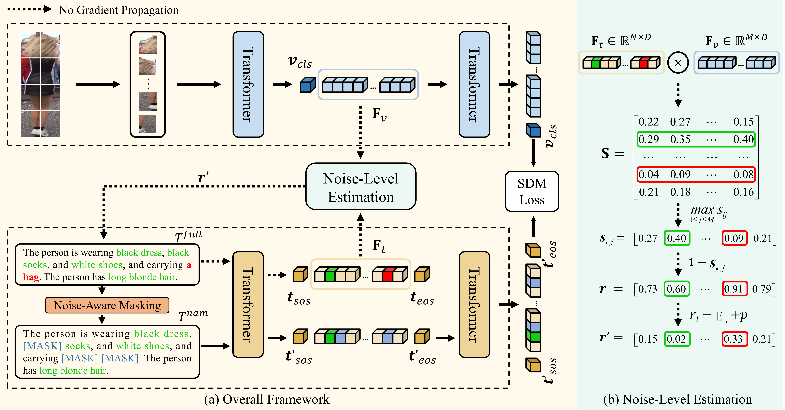

## [Harnessing the Power of MLLMs for Transferable Text-to-Image Person ReID](https://arxiv.org/abs/2207.03132) (CVPR 2024)

<!-- ### Introduction
This is the Pytorch implementation for M<sup>3</sup>L. -->



### Requirements
```
pytorch 1.9.0
torchvision 0.10.0
prettytable
easydict
```

### 1、Construct LUPerson-MLLM
- Download the LUPerson images from [here](https://github.com/DengpanFu/LUPerson)
- Use MLLMs to annotate LUPerson images. Take [Qwen](https://github.com/QwenLM/Qwen-VL) as an example. The code for image captioning is provided in the ```captions``` folder. Inside, you will find 46 templates along with static and dynamic instructions. You can download all the descriptions for the final LUPerson-MLLM from [here](https://huggingface.co/datasets/TwT-6/LUPerson-MLLM-captions).
- Place the generated descriptions in the ```captions``` folder.

### 2、Prepare Downstream Datasets
Download the CUHK-PEDES dataset from [here](https://github.com/ShuangLI59/Person-Search-with-Natural-Language-Description), ICFG-PEDES dataset from [here](https://github.com/zifyloo/SSAN) and RSTPReid dataset form [here](https://github.com/NjtechCVLab/RSTPReid-Dataset)

### 3、Pretrain Model (direct transfer setting)
To pretrain your model, you can simply run ```sh run.sh --pretrain LUPerson-MLLM```. After the model training is completed, it will provide the performance of direct transfer setting.

### 4、Fine-tune the Pretrained Model on Downstream Datasets (fine-tune setting)
To fine-tune your model, you can simply run ```sh run.sh --finetune checkpoint.pth```. After the model training is completed, it will provide the performance of fine-tune setting.

